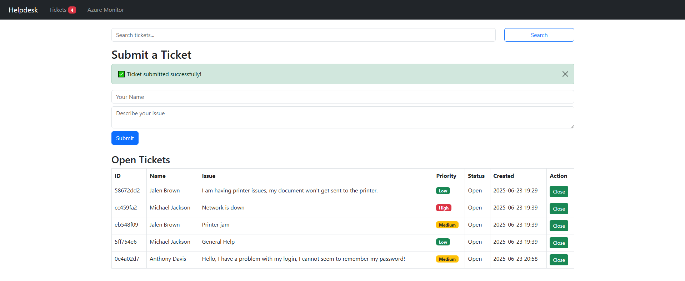
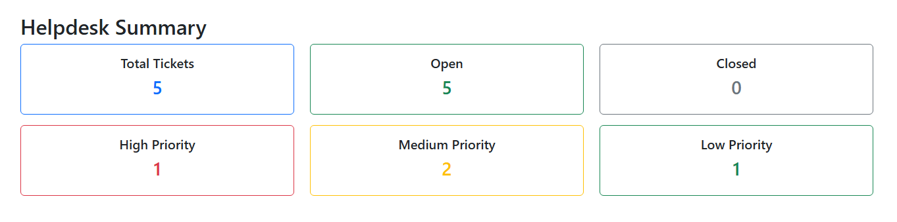
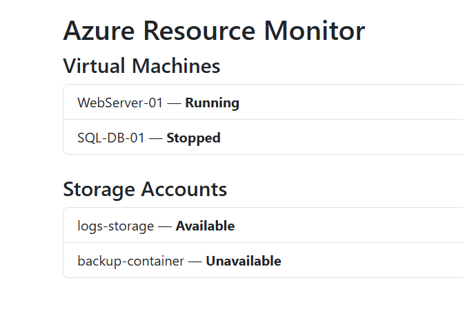
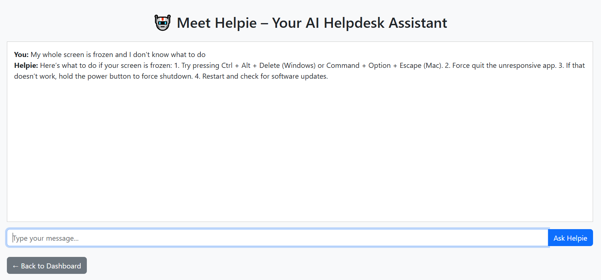

# Cloud Helpdesk Dashboard 💻☁️

A professional-grade Flask web application simulating a real-world IT helpdesk dashboard. Designed to support and edit ticket submissions, display live dashboard summaries, and a mock Azure resource monitor.

---

## 📸 Screenshots

### 📝 Ticketing System
> Users can submit issues with auto-prioritization (High, Medium, Low)

  

---

### 📊 Dashboard Summary
> Real-time count of total, open, closed, and priority-level tickets

  

---

### ☁️ Azure Monitor (Mocked)
> Simulates status of cloud-based resources like VMs and storage accounts

  

---

### 🤖 Helpie – AI Chatbot
> Friendly AI assistant for basic IT troubleshooting and guidance

  

---

## ⚙️ Features

- 🎫 Submit and manage tickets with live status and priority tags
- ✏️ **Edit existing tickets**: Update priority, add internal helpdesk comments, or reassign status
- 👥 **Assign tickets to fake helpdesk users** for demo purposes
- 🧠 Auto-classification using keyword-based logic
- 📊 Dashboard view with real-time counts
- ☁️ Azure panel simulating virtual machine and storage status
- 🤖 **Helpie AI Chatbot**: Handles common IT issues using natural language
- ✅ Bootstrap 5 responsive design with styled alerts and badges

---

## 🛠️ Technologies Used

- Python 3 / Flask
- HTML, CSS, Bootstrap 5
- JSON (for local ticket and cloud resource data)
- Git & GitHub
- Replit (deployment platform)

---

## 📁 Project Structure
cloud-helpdesk-dashboard/

│

├── app.py

├── templates/

├── static/

├── data/

├── requirements.txt

└── README.md

---

## 📩 Questions or Feedback?

Reach me at: **ashfaqkhan900@outlook.com**

---

## ⚠️ Notice

This project is publicly accessible for demo purposes. Ticket submissions are **not moderated**, so please avoid sharing sensitive or inappropriate content. To make it secure, user authentication and input validation would be required in a production environment.

---
